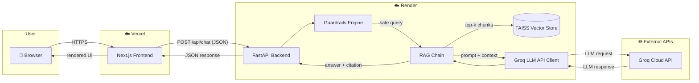
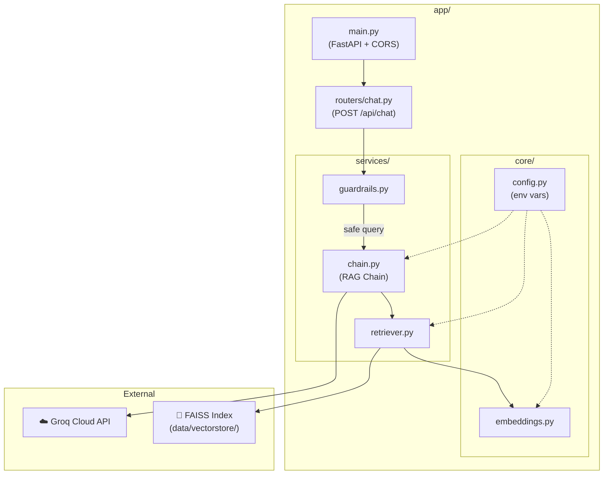
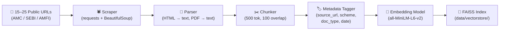
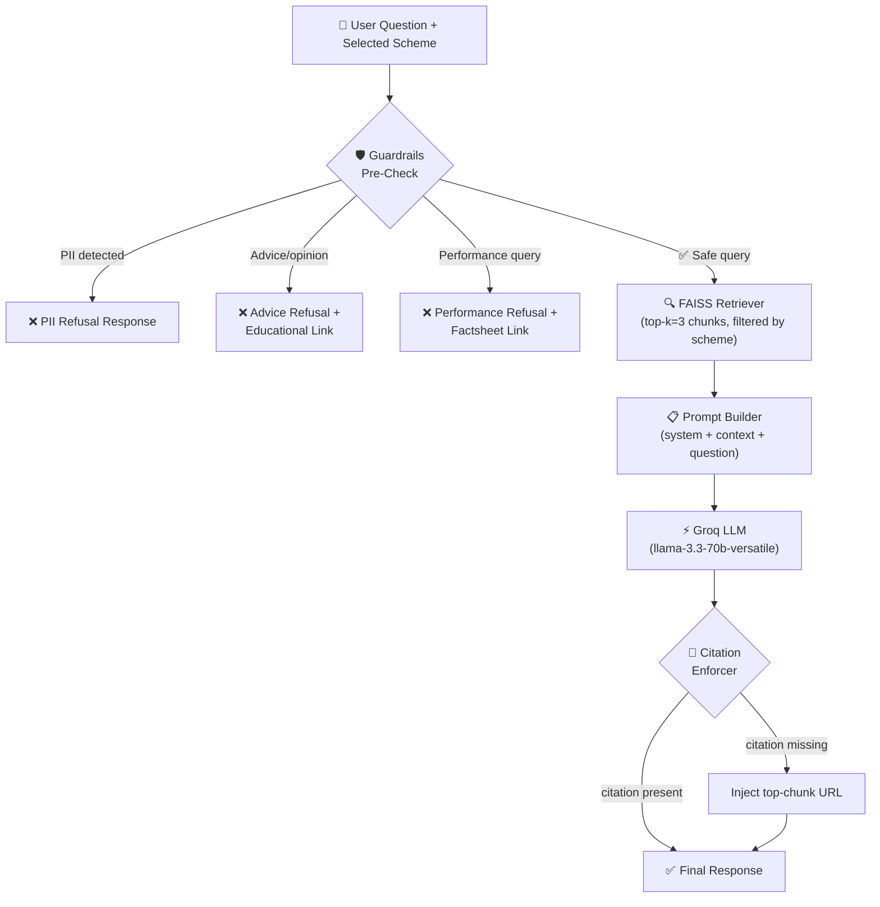
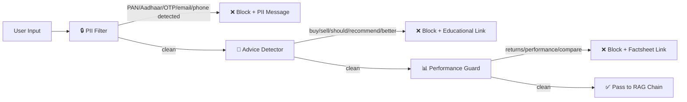
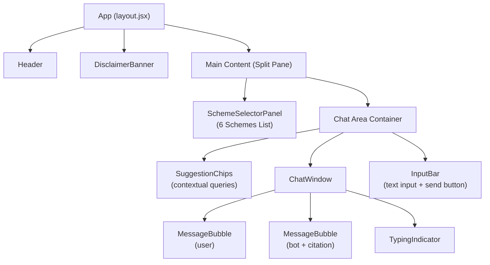
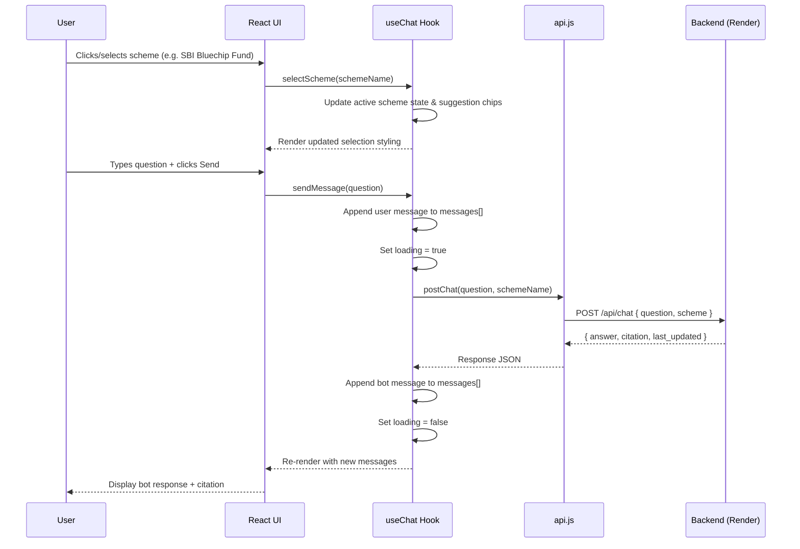
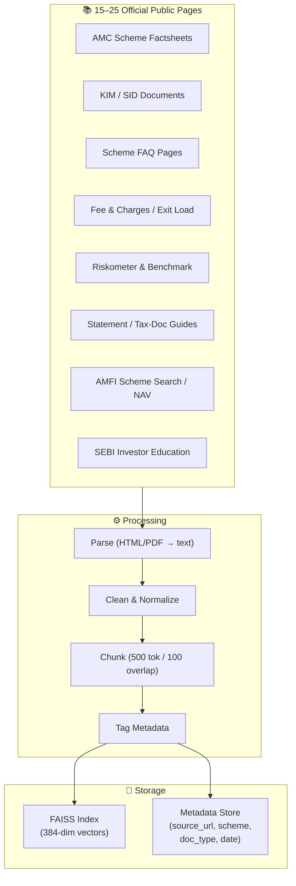
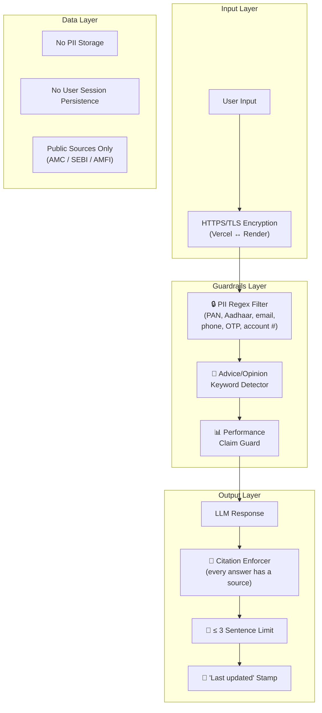

# RAG-based Mutual Fund FAQ Chatbot — Architecture

> System architecture derived from [implementation.md](./implementation.md)

---

## 1. High-Level System Overview



---

## 2. Deployment Topology

```
┌────────────────────────┐        HTTPS / JSON         ┌────────────────────────┐
│                        │  ───────────────────────►    │                        │
│   ☁️  VERCEL            │                              │   ☁️  RENDER            │
│   (Next.js Frontend)   │  ◄───────────────────────    │   (FastAPI Backend)    │
│                        │                              │                        │
│  • Static HTML/CSS/JS  │                              │  • /api/chat endpoint  │
│  • React components    │                              │  • RAG pipeline        │
│  • Client-side state   │                              │  • FAISS vector store  │
│  • Micro-animations    │                              │  • Guardrails engine   │
│                        │                              │  • Groq LLM client     │
└────────────────────────┘                              └────────────────────────┘
         ▲                                                        │
         │                                                        ▼
   mf-faq.vercel.app                                    ┌────────────────────┐
                                                        │  🌐 Groq Cloud API  │
                                                        │  (LPU Inference)   │
                                                        └────────────────────┘
```

| Layer | Technology | Hosted On |
|---|---|---|
| **Frontend** | Next.js (React, App Router) | Vercel |
| **Backend API** | FastAPI (Python) | Render |
| **LLM Inference** | Groq Cloud (`llama-3.3-70b-versatile`) | Groq API |
| **Vector Database** | FAISS (in-process, persisted to disk) | Render (local file) |
| **Embeddings** | HuggingFace `sentence-transformers/all-MiniLM-L6-v2` | Render (in-process) |

---

## 3. Backend Architecture

### 3.1 Module Dependency Map



### 3.2 Directory Structure

```
backend/
├── app/
│   ├── main.py              # FastAPI app, CORS middleware, lifespan events
│   ├── routers/
│   │   └── chat.py          # POST /api/chat — request/response models
│   ├── services/
│   │   ├── guardrails.py    # PII filter, advice refusal, performance-claim guard
│   │   ├── chain.py         # RAG chain — prompt template + Groq LLM call
│   │   └── retriever.py     # FAISS similarity search + metadata extraction
│   └── core/
│       ├── config.py        # Pydantic Settings — GROQ_API_KEY, model name, etc.
│       └── embeddings.py    # HuggingFace SentenceTransformer wrapper
├── ingestion/
│   ├── scraper.py           # Download HTML/PDF from source URLs
│   ├── parser.py            # Extract text (BeautifulSoup + pdfplumber)
│   ├── chunker.py           # RecursiveCharacterTextSplitter (500 tok / 100 overlap)
│   └── indexer.py           # Embed chunks → build & persist FAISS index
├── data/
│   ├── raw/                 # Archived HTML/PDF source files
│   └── vectorstore/         # Persisted FAISS index + metadata pickle
├── .env.example
├── requirements.txt
├── Dockerfile
└── render.yaml
```

### 3.3 API Contract

#### `POST /api/chat`

**Request:**

```json
{
  "question": "What is the expense ratio?",
  "scheme": "SBI Bluechip Fund"
}
```

**Response (Success):**

```json
{
  "answer": "The expense ratio of SBI Bluechip Fund (Regular Plan) is 1.58% and (Direct Plan) is 0.82% as per the latest factsheet.",
  "citation": {
    "url": "https://www.sbimf.com/sbimf-scheme-details/sbi-large-cap-fund-(formerly-known-as-sbi-bluechip-fund)-43",
    "title": "SBI Bluechip Fund — Factsheet"
  },
  "last_updated": "June 2026",
  "refused": false
}
```

**Response (Refused — Advice):**

```json
{
  "answer": "I'm a facts-only assistant and cannot provide investment advice. For guidance, please visit AMFI's investor education resources.",
  "citation": {
    "url": "https://www.amfiindia.com/investor-corner/",
    "title": "AMFI — Investor Education"
  },
  "last_updated": null,
  "refused": true,
  "refusal_reason": "advice_request"
}
```

**Response (Refused — PII Detected):**

```json
{
  "answer": "I cannot process personal information like PAN, Aadhaar, or account numbers. Please ask a factual question about mutual fund schemes.",
  "citation": null,
  "last_updated": null,
  "refused": true,
  "refusal_reason": "pii_detected"
}
```

---

## 4. RAG Pipeline — Data Flow

### 4.1 Ingestion Pipeline (Offline / One-Time)



| Step | Input | Output | Tool |
|---|---|---|---|
| Scrape | URL list | HTML / PDF files | `requests`, `urllib` |
| Parse | Raw files | Plain text | `BeautifulSoup`, `pdfplumber` |
| Chunk | Full text | Overlapping text chunks | LangChain `RecursiveCharacterTextSplitter` |
| Tag | Chunks | Chunks + metadata dict | Custom Python |
| Embed | Tagged chunks | 384-dim vectors | `sentence-transformers` |
| Index | Vectors + metadata | FAISS flat index | `faiss-cpu` |

### 4.2 Query Pipeline (Real-Time)



---

## 5. Guardrails Architecture



### Guardrail Rules

| Guard | Detection Method | Trigger Examples | Action |
|---|---|---|---|
| **PII Filter** | Regex patterns for PAN (`[A-Z]{5}[0-9]{4}[A-Z]`), Aadhaar (`\d{4}\s?\d{4}\s?\d{4}`), email, phone, OTP | `"My PAN is ABCDE1234F"` | Block + return PII refusal message |
| **Advice Refusal** | Keyword matching + intent classification (keywords: `should`, `recommend`, `buy`, `sell`, `better`, `best`, `portfolio`) | `"Should I invest in this fund?"` | Block + return educational link |
| **Performance Guard** | Keyword detection (`returns`, `performance`, `CAGR`, `NAV growth`, `compare`) | `"What were the 5-year returns?"` | Block + link to official factsheet |
| **Citation Enforcer** | Post-LLM URL validation in response text | LLM omits source link | Inject `source_url` from top-ranked chunk metadata |

---

## 6. Frontend Architecture

### 6.1 Component Tree



### 6.2 Directory Structure

```
frontend/
├── public/
│   ├── favicon.ico
│   └── og-image.png
├── src/
│   ├── app/
│   │   ├── layout.jsx          # Root layout — fonts, metadata, global styles
│   │   ├── page.jsx            # Home page — assembles all components
│   │   └── globals.css         # CSS reset + design tokens import
│   ├── components/
│   │   ├── Header.jsx          # Logo + title + gradient glow
│   │   ├── DisclaimerBanner.jsx # Glassmorphic facts-only banner
│   │   ├── SuggestionChip.jsx  # Pill-shaped example question button
│   │   ├── ChatWindow.jsx      # Scrollable message list container
│   │   ├── MessageBubble.jsx   # User/bot message card + citation badge
│   │   ├── TypingIndicator.jsx # Animated dot-pulse loader
│   │   └── InputBar.jsx        # Fixed-bottom input + send button
│   ├── hooks/
│   │   └── useChat.js          # Custom hook — manages messages[], loading, sendMessage()
│   ├── lib/
│   │   └── api.js              # fetch wrapper — POST to backend /api/chat
│   └── styles/
│       ├── tokens.css          # CSS custom properties (colours, spacing, fonts)
│       ├── components.css      # Component-specific styles
│       └── animations.css      # @keyframes: fadeIn, slideUp, pulse
├── .env.local.example          # NEXT_PUBLIC_API_URL=
├── next.config.js
├── package.json
└── vercel.json
```

### 6.3 State Management Flow



---

## 7. Data Architecture

### 7.1 Source Corpus



### 7.2 Chunk Metadata Schema

```json
{
  "chunk_id": "sbi_bluechip_factsheet_chunk_003",
  "text": "The exit load for SBI Bluechip Fund is 1% if redeemed within 1 year...",
  "source_url": "https://www.sbimf.com/sbimf-scheme-details/sbi-large-cap-fund-(formerly-known-as-sbi-bluechip-fund)-43",
  "scheme_name": "SBI Bluechip Fund",
  "document_type": "factsheet",
  "date_accessed": "2026-06-01",
  "chunk_index": 3,
  "total_chunks": 12
}
```

---

## 8. Security & Compliance Architecture



### Compliance Summary

| Requirement | Implementation |
|---|---|
| **No PII storage** | Input-level regex filter blocks PAN, Aadhaar, email, phone, OTP before reaching LLM. No database stores user data. |
| **No advice** | Keyword-based pre-check + LLM system prompt constraint. Refusal returns educational link. |
| **No performance claims** | Keyword guard blocks returns/CAGR queries. Redirects to official factsheet. |
| **Public sources only** | Corpus restricted to AMC, SEBI, AMFI pages. Source URLs validated during ingestion. |
| **Transparency** | Every answer capped at 3 sentences. Citation link + "Last updated" date appended. |
| **HTTPS everywhere** | Vercel and Render both enforce TLS. Backend CORS restricted to Vercel domain. |

---

## 9. Technology Stack Summary

| Layer | Technology | Version | Purpose |
|---|---|---|---|
| **Frontend** | Next.js | 14+ | React-based SSR/CSR framework |
| **Styling** | Vanilla CSS | — | Design tokens, glassmorphism, animations |
| **Fonts** | Google Fonts (Inter, Outfit) | — | Modern typography |
| **Backend** | FastAPI | 0.111+ | Async Python web framework |
| **ASGI Server** | Uvicorn | 0.30+ | Production ASGI server |
| **LLM** | Groq Cloud API | — | Ultra-fast inference (LPU) |
| **LLM Model** | `llama-3.3-70b-versatile` | — | Primary generation model |
| **LLM Framework** | LangChain + `langchain-groq` | 0.2+ | RAG chain orchestration |
| **Embeddings** | `all-MiniLM-L6-v2` | — | 384-dim sentence embeddings (free, local) |
| **Vector DB** | FAISS (`faiss-cpu`) | 1.7+ | In-process similarity search |
| **PDF Parsing** | pdfplumber | — | PDF text extraction |
| **HTML Parsing** | BeautifulSoup4 | — | HTML text extraction |
| **Frontend Hosting** | Vercel | — | Edge CDN, auto-deploy from GitHub |
| **Backend Hosting** | Render | — | Free-tier Python web service |
| **Version Control** | Git + GitHub | — | Source code management |

---

## 10. Environment Variables

### Backend (`.env`)

```env
# Groq
GROQ_API_KEY=gsk_xxxxxxxxxxxxxxxxxxxxxxxx
GROQ_MODEL=llama-3.3-70b-versatile

# Embedding
EMBEDDING_MODEL=sentence-transformers/all-MiniLM-L6-v2

# FAISS
VECTORSTORE_PATH=./data/vectorstore

# Server
HOST=0.0.0.0
PORT=8000

# CORS
ALLOWED_ORIGINS=https://mf-faq.vercel.app
```

### Frontend (`.env.local`)

```env
NEXT_PUBLIC_API_URL=https://mf-faq-api.onrender.com
```
